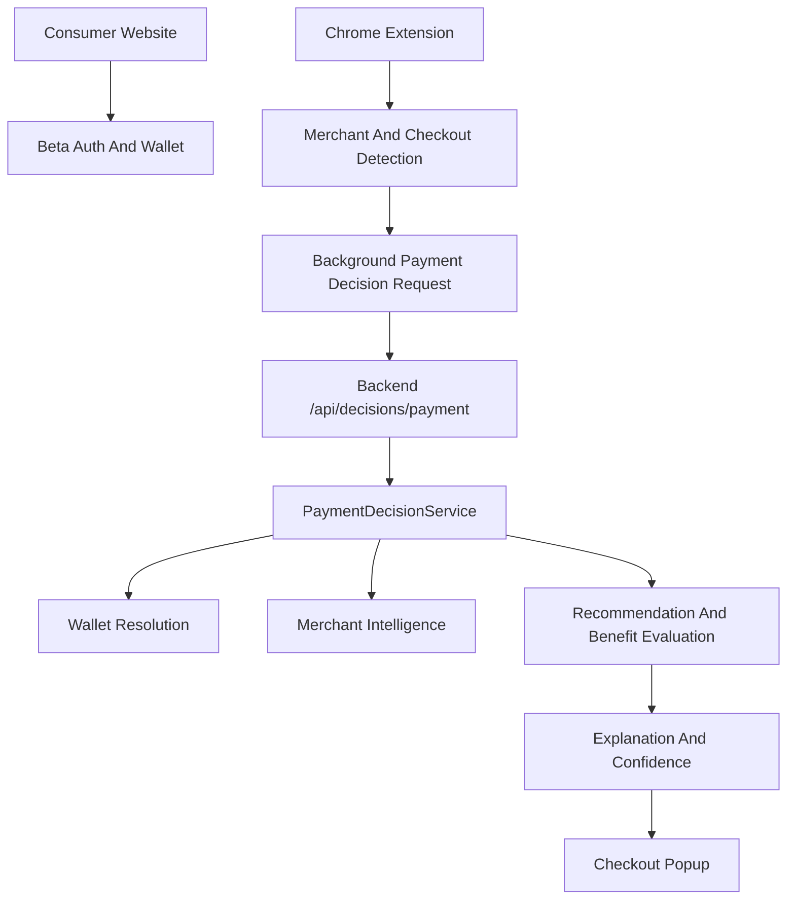
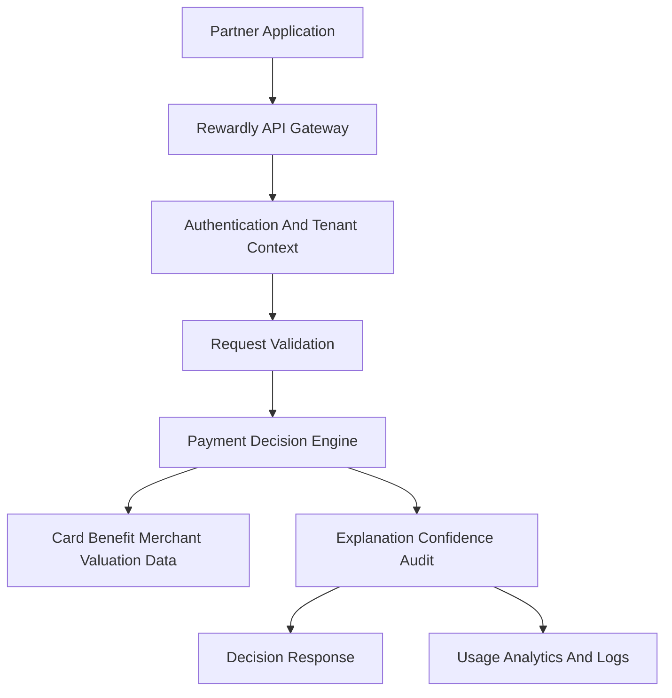
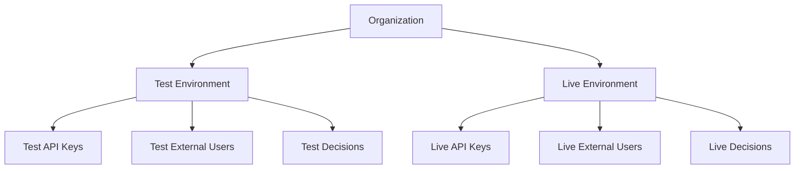
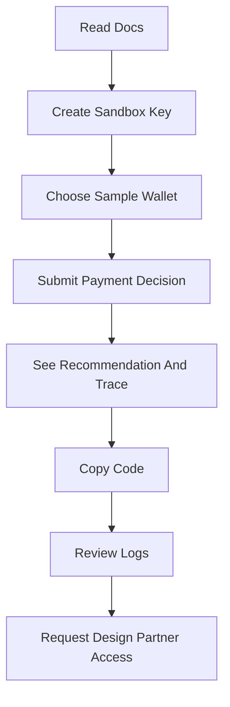
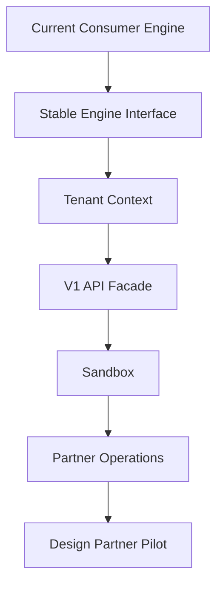

# Executive Blueprint

## 1. Rewardly V2 In One Sentence

Strategic recommendation: Rewardly is an API-based payment intelligence platform that helps financial products choose and explain the best payment method for a specific user, wallet, merchant, and purchase context.

## 2. Why Pivot

Confirmed from repository: Rewardly has outgrown a simple consumer extension. The codebase now contains wallet-first recommendation logic, merchant intelligence, benefit registry/versioning, decision explanations, confidence scoring, audit logs, analytics, feedback, and qualification infrastructure.

Strategic recommendation: Competing as another consumer card-optimization extension is less attractive than selling the underlying decision capability to companies that already own user relationships, wallet data, or payment moments.

## 3. Valuable Existing Technology

Preserve and harden:

- `PaymentDecisionService` as the current orchestration boundary.
- `WalletDecisionEngine` as core decision IP.
- `BenefitRegistryService`, benefit versioning, eligibility, wallet state, and confidence.
- Merchant intelligence and checkout/purchase context components.
- Deterministic validation, generated scenarios, mutation smoke tests, and private-beta qualification.

Reposition:

- Chrome extension becomes reference integration and internal test client.
- Website becomes onboarding, sandbox, and partner documentation.
- Existing beta auth remains only for reference/client beta until partner API auth exists.

## 4. Initial Customer

Primary initial segment: consumer personal-finance applications and AI financial assistants that already know which cards a user owns and want to turn static wallet data into actionable payment guidance.

Buyer: founder, head of product, or CTO at a small to mid-stage fintech.

Why this won: reachable founder-led sales, clear user value, shorter integration than banks, strong need for explainability, and high fit with existing wallet-first engine.

Secondary segment: credit-card discovery and rewards websites that want post-acquisition utility beyond affiliate conversion.

Deferred segment: large banks and card issuers. They have budget but long sales cycles, security reviews, procurement, and integration complexity that are poor first targets.

## 5. Customer Problem

Financial products may know the cards a user owns, but they typically do not have reliable reward rules, benefit eligibility, merchant normalization, purchase context, valuation logic, confidence, and explanation infrastructure.

Rewardly turns wallet data into a decision.

## 6. Product

MVP product: a versioned `/v1/payment-decisions` API that accepts a partner-scoped user/wallet and purchase context, returns one recommended payment method, alternatives, estimated value, incremental value, explanation, confidence, warnings, and applied-rule trace.

The customer controls the UI.

## 7. MVP

Launch requirements:

- Organization and test/live environment model.
- Hashed API keys with `rw_test_` and `rw_live_` prefixes.
- `POST /v1/payment-decisions`.
- Wallet supplied inline and optional persisted test wallets.
- Idempotency key support.
- Stable errors.
- Decision audit record.
- Usage metering.
- Sandbox and docs.

Design-partner requirements:

- Recent requests and errors.
- Decision replay for test mode.
- Unknown card and low-confidence queues.
- Basic usage reporting.

Post-MVP:

- Full partner dashboard roles, billing automation, webhooks, SDKs, Plaid, issuer sync, card acquisition, public consumer extension launch.

## 8. Differentiation

Valuable now:

- Wallet-first enforcement.
- Rule precedence.
- Versioned benefit data.
- Explainable decision trace.
- Confidence and warnings.
- Regression validation.

Defensible over time:

- Decision-quality feedback loops from real partner integrations.
- Merchant and benefit operations workflow.
- Scenario and regression corpus.
- Partner-specific valuation and edge-case resolution.

## 9. API Model

Recommendation: support both inline wallet input and persisted wallets, but launch with inline wallet as the fastest integration path. Persisted wallets are design-partner scope when partners want decision replay, lower request payloads, or stateful benefit usage.

Core endpoint:

```text
POST /v1/payment-decisions
```

Authentication:

```text
Authorization: Bearer rw_test_...
Idempotency-Key: customer-generated-key
```

## 10. Security Posture

Rewardly should avoid PCI scope by not collecting card numbers, CVVs, bank credentials, payment execution data, or issuer-login credentials. Store API keys hashed. Scope every record to organization and environment. Redact secrets in logs and reports.

Requires legal review: financial-advice language, data-processing agreement, privacy policy, issuer/card-network terms, and reward-data licensing.

## 11. Business Model

Initial pricing hypothesis: design-partner pilot with discounted or free sandbox, then base platform fee plus included decision volume and overage per 1,000 successful decisions.

Do not build billing before a design partner confirms the integration path and value metric.

## 12. GTM Motion

Founder-led, design-partner first:

1. 20 targeted discovery calls.
2. Demo current engine and draft API.
3. Select 2-5 design partners.
4. Integrate sandbox.
5. Review low-confidence decisions weekly.
6. Convert one partner to a paid pilot.

## 13. Six-Week Plan

Week 1: finalize blueprint, freeze consumer roadmap, pick ICP, create outreach list, validate API contract.
Week 2: wrap engine boundary, define tenant model, begin interviews.
Week 3: build test API facade and API keys, continue interviews, draft sandbox.
Week 4: add logs, idempotency, usage records, onboard first design partner to sandbox.
Week 5: improve decision quality from partner scenarios, add support/replay tools.
Week 6: run production pilot readiness, decide pricing and next investment.

## 14. Key Risks

- Willingness to pay is unproven.
- Card/benefit data may be hard to keep current.
- Merchant classification uncertainty could reduce trust.
- Consumer assumptions can leak into tenant architecture.
- Legal/security review may slow design-partner conversion.

## 15. Open Decisions

- Exact first design-partner segment.
- Inline wallet only versus persisted wallets in MVP.
- Default valuation assumptions.
- Decision retention length.
- Whether applied-rule trace is returned by default.

## 16. Exact Next Sprint

Sprint 9.1: Core Platform Boundary. Wrap the existing payment decision logic behind a B2B internal engine interface and add compatibility tests proving current recommendation results are unchanged.

Do not start Sprint 9.1 until the founder approves this blueprint.

## Current Consumer Architecture



## Target Architecture



## Multi-Tenant Model



## Decision Pipeline

```mermaid
flowchart LR
  A[Validate Request] --> B[Resolve Tenant]
  B --> C[Resolve Wallet]
  C --> D[Normalize Merchant]
  D --> E[Normalize Purchase]
  E --> F[Load Versioned Rules]
  F --> G[Evaluate Eligibility]
  G --> H[Score Candidates]
  H --> I[Select Winner]
  I --> J[Explain And Warn]
  J --> K[Persist Audit]
  K --> L[Serialize Response]
```



## Developer Journey



## Migration Sequence


